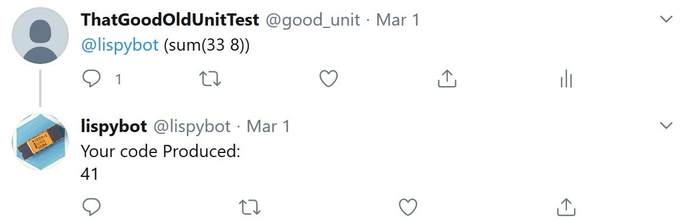

<div>
    </img>
    </img>
</div>

# Lispy-Twitter-Bot
🐍🤖 Lispy Twitter Bot executes the lisp code you tweet at it


This is part of a quick toy project I created that would execute lisp code that was tweet at a bot.
The full project contains a UI along with a REST API that can recieve and store the tweets in a MongoDB database. This is located elsewhere.

Simply fill in the config variables and set the target 

If you are interested in this idea, I would recommend that you check out the [BBC Micro 🦉 bot](https://twitter.com/bbcmicrobot) by [Dominic Pajak](https://github.com/8bitkick) which is similar in concept and built upon the BBC Micro Emulator created by [Matt Godbolt](https://github.com/mattgodbolt). It executes code written in BBC Basic and even provides GIF animations of the output.

## Dependencies
This project is dependent on the following dependencies:
* [little lisp](https://github.com/maryrosecook/littlelisp) by [Mary Rose Cook]((https://github.com/maryrosecook/)
* [Twit](https://github.com/ttezel/twit) by [Tolga Tezel](https://github.com/ttezel/)

## Installation
```
npm install
```

## Run 
```
npm start
```


## Code in Action

